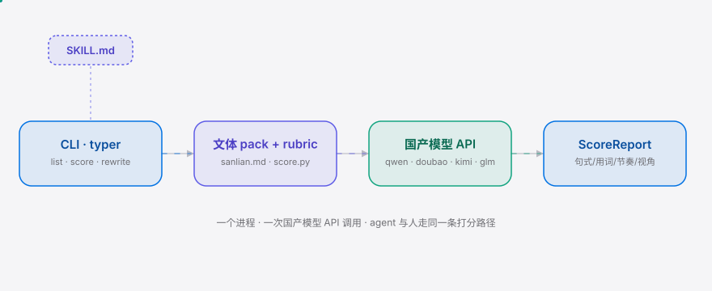

**English** | [简体中文](./README.md)

<div align="right"><sub><b>EN</b>&nbsp;&nbsp;⇄&nbsp;&nbsp;<a href="./README.md">中文</a></sub></div>

<picture>
  <source media="(prefers-color-scheme: dark)" srcset="./assets/hero-dark.svg">
  <source media="(prefers-color-scheme: light)" srcset="./assets/hero-light.svg">
  
</picture>

<p align="center"><sub>Wenti is the Skill-native taste library giving prosumer 公众号 writers a curated 三联 voice.</sub></p>

<p align="center">
  <a href="./LICENSE"></a>
  <a href="https://github.com/SuperMarioYL/wenti/releases"></a>
  <a href="https://github.com/SuperMarioYL/wenti/actions/workflows/ci.yml"></a>
  
  
  
</p>

**Install a named Chinese editorial voice on an agent — not an anti-slop filter, a positive taste library.**

The Skill primitive has gone mainstream as a voice carrier: [taste-skill](https://github.com/Leonxlnx/taste-skill) (79k stars) proves that "give an agent a voice" is a large, actively-adopted product shape. But it is **negative** anti-slop — it removes AI tells without installing any *named* voice, so output stalls at "not bad, but not any particular thing." Wenti is its positive Chinese sibling: it turns an editorial perspective like 三联生活周刊体 into a hand-curated pack an agent can keep across a series, with a scoring rubric that measures the gap from bare-model output to voiced output. The "Chinese long-form needs a nameable editorial voice" thesis that content-aesthetic KOL [op7418](https://jike.city/op7418) keeps discussing is exactly what this rubric quantifies; cross-essay voice-consistency is also a long-term thread in [HKUDS](https://github.com/HKUDS)'s agent-capability research.

<h2> Architecture</h2>

<picture>
  <source media="(prefers-color-scheme: dark)" srcset="./assets/atlas-dark.svg">
  <source media="(prefers-color-scheme: light)" srcset="./assets/atlas-light.svg">
  
</picture>

One process (a typer CLI), one external API call (a domestic model via base_url), zero microservices. `SKILL.md` is a thin wrapper over the same CLI — an agent and a human hit the **identical** scoring path.

<h2> Why this exists</h2>

A 公众号 long-form writer today can prompt a bare model for generic AI prose, or bolt on an anti-slop skill and get prose that is no longer slop but is also no *particular* thing. The concrete failure moment: by essay #5 of a serial, you want it to read in the same 三联体 editorial voice as essay #1, and you end up re-voicing each piece by hand. Wenti makes "adopt and keep a named voice" an installable Skill — the taste library itself is the product, not a model and not a generic filter.

<h2> Quickstart</h2>

```bash
pipx install wenti                                    # or: uv tool install wenti
export WENTI_BASE_URL=... WENTI_API_KEY=...           # point at a domestic model (qwen default)
wenti score my_draft.md --pack sanlian               # 句式/用词/节奏/视角 + total + rewrite suggestions
```

With no key set, it auto-falls-back to a dry-run heuristic scorer (local, offline, reproducible) — `wenti list` / `wenti score --dry-run` work out of the box.

<details><summary>sample output (dry-run)</summary>

```
╭──────── score · my_draft.md ──────────╮
│  句式 0.3  [░░░░░]                    │
│  用词 0.5  [░░░░░]                    │
│  节奏 2.0  [██░░░]                    │
│  视角 2.4  [██░░░]                    │
│ total 1.12  / 5.0                     │
│ rewrite suggestions:                  │
│   1. [句式] flat sentences; 11 connective-first │
│   2. [用词] 16 AI-slop phrases (-1.3) │
╰───────────────────────────────────────╯
```
</details>

<h2> Usage</h2>

```bash
wenti list                                  # list voice packs (v0.1: sanlian 三联体)
wenti score draft.md --pack sanlian --json  # JSON report (for agent parsing)
wenti rewrite draft.md --pack sanlian       # rewrite in 三联体 voice card + few-shots
wenti score draft.md --pack sanlian --dry-run   # offline self-check, no model call
```

`--json` emits `{pack, sub_scores, total, suggestions, dry_run}`; an agent reads this shape and pins the pack id in-session to keep the voice across essays. Full examples: [`examples/before_after.md`](./examples/before_after.md) (same draft, bare vs 三联体, each scored) and [`SKILL.md`](./SKILL.md) (the agent invocation contract).

<h2> Demo</h2>


The same bare-model draft, with the 三联体 pack, lifts the total from **1.12 → 3.82** (delta +2.70, all four dimensions improve). This is the entire product thesis made falsifiable in one file — see [`examples/before_after.md`](./examples/before_after.md).

<h2> Configuration</h2>

| key | type | default | meaning |
|---|---|---|---|
| `WENTI_BASE_URL` | str | — | OpenAI-compatible endpoint (domestic model base_url) |
| `WENTI_API_KEY` | str | — | api key for that endpoint |
| `WENTI_MODEL` | str | `qwen-max` | model name (doubao/kimi/glm all work) |
| `--dry-run` | flag | auto | auto-enabled when env unset; local heuristic scoring |
| `--pack` | str | `sanlian` | voice pack id (v0.1: sanlian only) |

Rubric dimensions & weights (`wenti/scorer/rubric.yaml`, locked in mvp_plan §2): 句式 0.3 / 用词 0.3 / 节奏 0.2 / 视角 0.2, `total = Σ(weight × sub_score)`, 0–5.

<h2> Pricing</h2>

v0.1 is entirely **free + OSS** — one 三联体 pack, a local scorer, a CLI, MIT-licensed, no paywall. The commercial shape is **deliberately post-v0.1**:

- **Free tier**: 三联体 pack + local `wenti score/rewrite`, free forever.
- **Premium voice packs**: 南方周末体 / GQ报道体 / 新周刊体 — ¥39 per pack, ¥99/mo bundle (includes early access to new packs).
- **Hosted scoring endpoint**: ¥29/seat/month — no API key, no terminal; paste a 公众号 draft, get the before/after scores. For prosumer writers who won't touch a CLI and 3–5-person self-media studios (cross-essay voice drift in a serial column is a daily pain).
- **Enterprise license**: house-style enforcement at scale for media orgs (三联 / GQ CN).

Smallest "here's my credit card" path: a hosted web demo (no install) → paste a draft, see the 三联体 score → paywall "want 南方周末体? ¥39 to unlock." The v0.1 CLI is the OSS proof layer; the hosted demo is the funnel; the premium pack is the first charge. We won't over-engineer billing before install count clears ~500.

<h2> vs taste-skill</h2>

| axis | Wenti | [taste-skill](https://github.com/Leonxlnx/taste-skill) |
|---|---|---|
| polarity | positive (installs a named voice) | negative (removes slop) |
| CN long-form voice pack | ✓ 三联体 hand-curated | — |
| scoring rubric (falsifiable) | ✓ 句式/用词/节奏/视角 | — |
| cross-essay series consistency | ✓ pinned pack id | — |
| global adoption scale | — (v0.1, just starting) | ✓ 79k stars |
| generic anti-slop coverage | partial (CN long-form only) | ✓ (cross-locale, generic) |

taste-skill is genuinely better on **scale and generic anti-slop coverage** — it's the 79k-star category leader. Wenti does not compete on generic anti-slop; it only does positive CN long-form, a narrow surface. The moat is the rubric + cross-essay consistency, not the few-shots themselves (few-shots are copyable in a single PR).

<h2> Roadmap</h2>

- [x] **m1** — 三联体 pack (voice card + few-shots) + scoring rubric + LLM-as-judge scorer + `wenti score/rewrite` CLI + before/after demo
- [ ] **m2** — 南方周末体 / GQ报道体 premium packs; cross-essay series-consistency memory
- [ ] **m3** — Hosted scoring endpoint (no CLI); WeChat Pay + phone-number auth; 2–3 design-partner 公众号 serialized essays in the wild
- [ ] Later — Enterprise house-style license; automated pack generation (internal tool only, never public — public release would dissolve the moat)

<h2> License</h2>

MIT, see [LICENSE](./LICENSE). File issues / PRs at [Issues](https://github.com/SuperMarioYL/wenti/issues).

<h2> Share</h2>

```
Wenti — a Skill that installs a nameable Chinese long-form editorial voice on an agent. 三联体 pack + a scoring rubric quantify the bare-model → 三联体 gap on a 0-5 scale: 1.12 → 3.82. Not an anti-slop filter — a positive taste library. https://github.com/SuperMarioYL/wenti
```

<p align="center"><sub><a href="./LICENSE">MIT</a> © 2026 SuperMarioYL</sub></p>
